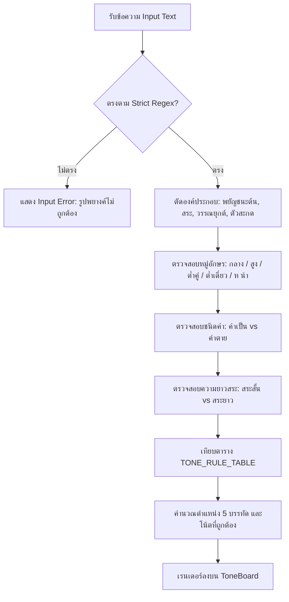
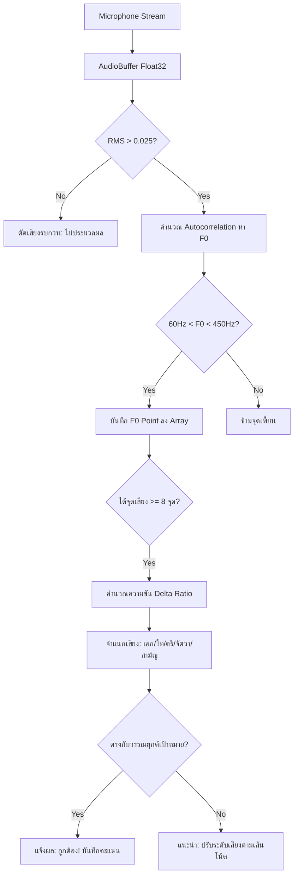

# เอกสารสถาปัตยกรรมระบบ กฎไตรยางศ์ ตรรกะ อัลกอริทึม และคู่มือการพัฒนาระบบ
## Thai Tone & 5-Line Staff Notation Application (ThaiTone App)
**เอกสารฉบับสมบูรณ์สำหรับผู้พัฒนา (Single Source of Truth & Developer Manual)**
**เวอร์ชันเอกสาร:** 2.0 (Full Architecture, Linguistic Rules, Audio DSP, Component Wiring, Legal & Mobile Roadmap)  
**วันที่บันทึก:** 2026-09-22

---

## สารบัญ (Table of Contents)
1. [ภาพรวมของระบบและเป้าหมาย (System Overview & Mission)](#1-ภาพรวมของระบบและเป้าหมาย)
2. [กฎภาษาศาสตร์และตรรกะการผันวรรณยุกต์ (Thai Tone & Triyang Linguistic Specification)](#2-กฎภาษาศาสตร์และตรรกะการผันวรรณยุกต์)
   - 2.1 โครงสร้างพยางค์ภาษาไทยและ Regex Pattern
   - 2.2 ไตรยางศ์ 44 ตัว (อักษร 3 หมู่)
   - 2.3 การจำแนกคำเป็น / คำตาย (Live vs Dead Syllables)
   - 2.4 ตารางกฎการผันวรรณยุกต์ 5 เสียงและพื้นเสียง
   - 2.5 การผันครบ 5 เสียงของอักษรต่ำ (อักษรคู่ vs อักษรเดี่ยว / ห นำ / อ นำ / คำควบกล้ำ)
3. [อัลกอริทึมการประมวลผลสัญญาณเสียง (Acoustic DSP & Pitch Detection Algorithms)](#3-อัลกอริทึมการประมวลผลสัญญาณเสียง)
   - 3.1 การหาความถี่พื้นฐาน F0 ด้วย Autocorrelation
   - 3.2 การจำแนกรูปทรงเส้นเสียง (Pitch Contour & Slope Classification)
   - 3.3 การเทียบความถี่กับบรรทัด 5 เส้น (5-Line Staff Mapping)
4. [สถาปัตยกรรมการให้บริการเสียงและระบบแคช (Audio Service & Multi-Tier Caching)](#4-สถาปัตยกรรมการให้บริการเสียงและระบบแคช)
   - 4.1 สถาปัตยกรรมแคช 4 ระดับ (Multi-Tier Architecture)
   - 4.2 ระบบเล่นเสียงแบบ Promise-based & Fallback Chain
5. [สถาปัตยกรรมคอมโพเนนต์และการไหลของข้อมูล (Component Architecture & Data Flow)](#5-สถาปัตยกรรมคอมโพเนนต์และการไหลของข้อมูล)
   - 5.1 ผังโครงสร้างคอมโพเนนต์ (Component Tree)
   - 5.2 สถานะกลางและการสื่อสารสองจอ (Dual-Monitor BroadcastChannel)
   - 5.3 รายละเอียด Props Interface ของแต่ละคอมโพเนนต์
6. [ผังการทำงานของระบบ (System Flowcharts)](#6-ผังการทำงานของระบบ)
   - 6.1 Flowchart: การวิเคราะห์พยางค์และการตัดสินวรรณยุกต์
   - 6.2 Flowchart: การตรวจจับและประเมินระดับเสียงไมโครโฟน
   - 6.3 Flowchart: การยืนยันตัวตนและความยินยอมทางกฎหมาย
7. [ข้อกำหนดทางกฎหมาย ลิขสิทธิ์ และความปลอดภัย (Legal, Copyright & PDPA Compliance)](#7-ข้อกำหนดทางกฎหมาย-ลิขสิทธิ์-และความปลอดภัย)
   - 7.1 การเก็บข้อมูลขั้นต่ำ (Data Minimization)
   - 7.2 สิทธิของเจ้าของข้อมูล (Data Subject Rights & Account Deletion)
   - 7.3 การคุ้มครองลิขสิทธิ์และทรัพย์สินทางปัญญา
8. [คู่มือการต่อยอดเป็นแอปบน Apple (iOS) และ Android](#8-คู่มือการต่อยอดเป็นแอปบน-apple-ios-และ-android)
   - 8.1 การติดตั้งและตั้งค่า Capacitor
   - 8.2 การขอสิทธิ์ไมโครโฟนบน iOS และ Android
   - 8.3 ข้อบังคับของ Apple App Store & Google Play Console

---

## 1. ภาพรวมของระบบและเป้าหมาย
แอปพลิเคชัน Thai Tone เป็นระบบนวัตกรรมการเรียนรู้ภาษาไทยผ่านโน้ตดนตรีสากล (5-Line Musical Staff) ที่เชื่อมโยง **กฎไตรยางศ์ อักษร 3 หมู่ คำเป็น/คำตาย** เข้ากับ **ระดับความถี่เสียง (Pitch Frequencies)** และ **รูปทรงการเคลื่อนที่ของเสียง (Pitch Contour)** 
ระบบออกแบบเป็น Web Application บนฐาน React + Vite และ Cloudflare Pages Functions พร้อมรองรับการแปลงเป็น Native Mobile Application (iOS & Android) ผ่าน Capacitor

---

## 2. กฎภาษาศาสตร์และตรรกะการผันวรรณยุกต์

### 2.1 โครงสร้างพยางค์ภาษาไทยและ Regex Pattern
ระบบใช้ Regex ในการตรวจสอบความถูกต้องของพยางค์เดี่ยวภาษาไทยอย่างเข้มงวด:
```javascript
export const STRICT_THAI_SYLLABLE_PATTERN =
  /^[เแโใไ]?[ก-ฮ]{1,2}[ิีึืุูั็ํ]?[่้๊๋]?(?:[ายวอ]|ำ)?[ก-ฮ]?(?:ะ|์)?$/;
```
โครงสร้างพยางค์ประกอบด้วย 5 องค์ประกอบ:
1. **พยัญชนะต้น (Initial Consonant):** 1 หรือ 2 ตัว (ควบกล้ำ/อักษรนำ)
2. **สระ (Vowel):** สระหน้า (เ แ โ ใ ไ), สระบน/ล่าง (ิ ี ึ ื ุ ู ั ํ), สระหลัง (า ะ ย ว อ ำ)
3. **วรรณยุกต์ (Tone Mark):** ว่าง (ไม่มีรูป), ่ (เอก), ้ (โท), ๊ (ตรี), ๋ (จัตวา)
4. **ตัวสะกด (Final Consonant):** ก-ฮ ตามมาตราตัวสะกด 8 แม่
5. **ตัวการันต์ (Thanthakhat):** ์ สำหรับตัดเสียงตัวสะกดส่วนเกิน

### 2.2 ไตรยางศ์ 44 ตัว (อักษร 3 หมู่)
*   **อักษรกลาง (9 ตัว):** `ก, จ, ด, ต, บ, ป, อ, ฎ, ฏ`
*   **อักษรสูง (11 ตัว):** `ข, ฃ, ฉ, ฐ, ถ, ผ, ฝ, ศ, ษ, ส, ห`
*   **อักษรต่ำ (24 ตัว)** แบ่งเป็น:
    *   **อักษรต่ำเดี่ยว (10 ตัว - ไม่มีเสียงสูงคู่กัน):** `ง, ญ, ณ, น, ม, ย, ร, ล, ฬ, ว`
    *   **อักษรต่ำคู่ (14 ตัว - มีเสียงสูงเป็นคู่เสียง):** `ค, ฅ, ฆ, ช, ฌ, ซ, ฑ, ฒ, ท, ธ, พ, ภ, ฟ, ฮ`

**ตารางคู่เสียงต่ำ-สูง (Low-High Pairs):**
| อักษรต่ำคู่ | อักษรสูงคู่เทียบ |
|:---|:---|
| ค, ฅ, ฆ | ข |
| ช, ฌ | ฉ |
| ซ | ศ, ษ, ส |
| ฑ, ฒ, ท, ธ | ฐ, ถ |
| พ, ภ | ผ |
| ฟ | ฝ |
| ฮ | ห |

### 2.3 การจำแนกคำเป็น / คำตาย (Live vs Dead Syllables)
*   **คำเป็น (Live Syllable):**
    1. ไม่มีตัวสะกด และประสมด้วย **สระเสียงยาว** (รวมสระเกิน: ำ, ใ-, ไ-, เ-า)
    2. มีตัวสะกดในแม่ **กง, กน, กม, เกย, เกอว** (หลักจำ: "นมยวง")
*   **คำตาย (Dead Syllable):**
    1. ไม่มีตัวสะกด และประสมด้วย **สระเสียงสั้น**
    2. มีตัวสะกดในแม่ **กก, กด, กบ** (หลักจำ: "กบด")

### 2.4 ตารางกฎการผันวรรณยุกต์ 5 เสียงและพื้นเสียง
คำว่า **"พื้นเสียง"** คือเสียงของคำเมื่อไม่มีรูปวรรณยุกต์ปรากฏ:

| หมู่อักษร | ชนิดคำ | พื้นเสียง (ไม่มีรูป) | รูป ่ (เอก) | รูป ้ (โท) | รูป ๊ (ตรี) | รูป ๋ (จัตวา) | จำนวนเสียงที่ผันได้ |
|:---|:---|:---:|:---:|:---:|:---:|:---:|:---:|
| **อักษรกลาง** | คำเป็น | **สามัญ** | เอก | โท | ตรี | จัตวา | 5 เสียง |
| **อักษรกลาง** | คำตาย | **เอก** | - | โท | ตรี | จัตวา | 4 เสียง |
| **อักษรสูง** | คำเป็น | **จัตวา** | เอก | โท | - | - | 3 เสียง |
| **อักษรสูง** | คำตาย | **เอก** | - | โท | - | - | 2 เสียง |
| **อักษรต่ำ** | คำเป็น | **สามัญ** | โท | ตรี | - | - | 3 เสียง |
| **อักษรต่ำ** | คำตาย (สระสั้น) | **ตรี** | โท | - | - | - | 2 เสียง |
| **อักษรต่ำ** | คำตาย (สระยาว) | **โท** | - | ตรี | - | - | 2 เสียง |

### 2.5 การผันครบ 5 เสียงของอักษรต่ำ (Complementary Pairing)
เนื่องจากอักษรต่ำผันได้เพียง 3 เสียงตามธรรมชาติ การผันให้ครบ 5 เสียงต้องใช้ระบบจับคู่:
1.  **อักษรต่ำคู่:** ใช้คู่เสียงอักษรสูงมาช่วยผัน เช่น:
    *   สามัญ: **คา** (ต่ำ)
    *   เอก: **ข่า** (สูง + ่)
    *   โท: **ค่า / ข้า** (ต่ำ + ่ หรือ สูง + ้)
    *   ตรี: **ค้า** (ต่ำ + ้)
    *   จัตวา: **ขา** (สูงพื้นเสียง)
2.  **อักษรต่ำเดี่ยว:** ไม่มีอักษรสูงคู่โดยตรง ต้องใช้ **"ห นำ"** เช่น:
    *   สามัญ: **มา** (ต่ำ)
    *   เอก: **หม่า** (ห นำ + ่)
    *   โท: **ม่า / หม้า** (ต่ำ + ่ หรือ ห นำ + ้)
    *   ตรี: **ม้า** (ต่ำ + ้)
    *   จัตวา: **หมา** (ห นำพื้นเสียง)
3.  **อ นำ:** มี 4 คำในภาษาไทย ได้แก่ **อย่า, อยู่, อย่าง, อยาก** ทำหน้าที่เสมือนอักษรกลางนำต่ำเดี่ยว (ผันเสียงเอก)

---

## 3. อัลกอริทึมการประมวลผลสัญญาณเสียง (Acoustic DSP & Pitch Detection)

### 3.1 การหาความถี่พื้นฐาน F0 ด้วย Autocorrelation (`autoCorrelate`)
การตรวจจับระดับเสียงพูดจากไมโครโฟน ใช้หลักการ Autocorrelation แบบ Time-Domain:
```
R(k) = sum(x[n] * x[n+k]) for n = 0 to N-k-1
```
1.  **คำนวณ Root Mean Square (RMS):** 
    $$RMS = \sqrt{\frac{1}{N} \sum_{i=0}^{N-1} x[i]^2}$$
    หาก $RMS < 0.025$ จะถือว่าเป็นเสียงรบกวน (Noise Floor) และตัดทิ้งทันที ($F_0 = -1$)
2.  **Zero-Crossing & Peak Lag Detection:**
    ค้นหาตำแหน่ง $k_{max}$ (Lag) ที่ทำให้ค่าสหสัมพันธ์ $R(k)$ สูงที่สุด
3.  **คำนวณความถี่:**
    $$F_0 = \frac{\text{Sample Rate}}{k_{max}}$$

### 3.2 การจำแนกรูปทรงเส้นเสียง (Pitch Contour & Slope Classification)
ในการออกเสียงภาษาไทย วรรณยุกต์ไม่ได้มีแค่ระดับสูง-ต่ำ แต่มี **ทิศทางการเลื่อนของระดับเสียง (Slope)**:
ฟังก์ชัน `classifyToneContour(pitchPoints)` คำนวณความชัน:
$$\Delta = \frac{F_{\text{end}} - F_{\text{start}}}{F_{\text{avg}}}$$
*   **เสียงโท (Falling Tone - ID: 3):** $\Delta < -0.14$ (เสียงตกลงชัดเจน)
*   **เสียงจัตวา (Rising Tone - ID: 5):** $\Delta > 0.14$ (เสียงช้อนขึ้นสูง)
*   **เสียงเอก (Low Tone - ID: 2):** $\Delta < -0.05$ (เสียงต่ำ ทอดลงเล็กน้อย)
*   **เสียงตรี (High Tone - ID: 4):** $\Delta > 0.05$ (เสียงสูง ลอยตัว)
*   **เสียงสามัญ (Mid Tone - ID: 1):** ราบเรียบค่อนข้างคงที่

### 3.3 ค่าความถี่เป้าหมายและตำแหน่งบนบรรทัด 5 เส้น
| รหัสวรรณยุกต์ | ชื่อเสียง | ค่าความถี่เป้าหมาย (F0 Target) | ตำแหน่งบนบรรทัด 5 เส้น | ตำแหน่ง Left Offset (%) |
|:---:|:---|:---:|:---:|:---:|
| 1 | สามัญ (Mid) | 130 Hz | เส้นที่ 2 (นับจากล่าง) | 28% |
| 2 | เอก (Low) | 105 Hz | เส้นที่ 1 หรือ ใต้เส้น 1 | 40% |
| 3 | โท (Falling) | 175 Hz -> 110 Hz | เส้นที่ 3 ตกลงมาเส้น 1 | 52% |
| 4 | ตรี (High) | 220 Hz | เส้นที่ 4 หรือ 5 | 65% |
| 5 | จัตวา (Rising) | 120 Hz -> 190 Hz | ใต้เส้น 1 ช้อนขึ้นเส้น 3 | 80% |

---

## 4. สถาปัตยกรรมการให้บริการเสียงและระบบแคช

```
[User Request Play Sound]
          │
          ▼
   ┌───────────────┐        Yes
   │ In-Memory Map │ ───────────────► [Play Object URL immediately]
   └───────────────┘
          │ No
          ▼
   ┌───────────────┐        Yes
   │   IndexedDB   │ ───────────────► [Load Blob -> Create URL -> Play]
   └───────────────┘
          │ No
          ▼
   ┌────────────────────────┐        Yes
   │ Cloudflare Pages /api  │ ────────► [Download MP3 -> Save IndexedDB -> Play]
   │ (Azure PremwadeeNeural)│
   └────────────────────────┘
          │ 503 / Offline Fallback
          ▼
   ┌────────────────────────┐
   │ Browser Web Speech API │ ────────► [Synthesize th-TH voice directly]
   └────────────────────────┘
```

1.  **Tier 1: In-Memory Map Cache (`audioCache`):** เก็บ Object URL ในหน่วยความจำ RAM สำหรับคำที่เพิ่งเล่นไป เล่นซ้ำได้ใน 0 มิลลิวินาที
2.  **Tier 2: IndexedDB (`thai_tone_audio_cache`):** เก็บไฟล์ Audio Blob ถาวรในเบราว์เซอร์ของผู้ใช้ ทำให้เปิดเล่นซ้ำได้โดยไม่ต้องต่อเน็ตเวิร์ก
3.  **Tier 3: Cloudflare Pages Serverless Function (`/api/tts`):**
    *   ใช้ Microsoft Azure Cognitive Speech Service
    *   Voice: `th-TH-PremwadeeNeural`
    *   รูปแบบ SSML: ปรับแต่ง prosody rate (+/- %) ตามที่ผู้ใช้กำหนด
4.  **Tier 4: Client Fallback (Web Speech API):**
    *   หากเซิร์ฟเวอร์ Azure ขัดข้องหรือไม่มีเน็ตเวิร์ก จะสลับมาใช้ SpeechSynthesis ของอุปกรณ์โดยเลือกเสียงที่ขึ้นต้นด้วย `th-TH` อัตโนมัติ

---

## 5. สถาปัตยกรรมคอมโพเนนต์และการไหลของข้อมูล

### 5.1 ผังโครงสร้างคอมโพเนนต์ (Component Tree)
```
src/main.jsx
  └── src/App.jsx  (Root State, Layout Engine, Audio Controller)
        ├── src/components/Header.jsx  (Top Bar, View Switcher, 🌐 Lang, 👤 Auth Menu)
        │     └── src/components/AuthModal.jsx  (Sign In, Register, Profile, PDPA/Copyright)
        ├── src/components/ToneBoard.jsx  (5-Line Musical Staff, Canvas/SVG, Pitch Line)
        ├── src/components/ControlPanel.jsx  (Syllable Input, Vowel Matrix, Speed, Audio Test)
        ├── src/components/StaffQuizMode.jsx  (Gamified Interactive Tone Quiz)
        └── src/components/ApiKeyModal.jsx  (Custom Azure Key Setup)
```

### 5.2 การสื่อสารจอคู่ (Dual-Monitor Synchronisation)
ระบบรองรับการเปิดจอที่ 2 แยกต่างหากสำหรับการนำเสนอหรือฉายขึ้นโปรเจกเตอร์:
*   ใช้ **`BroadcastChannel('thai_tone_sync_channel')`**
*   **Main Screen (Sender):** ส่ง Event `{ type: 'UPDATE_STATE', payload: { linesData, inputText, toneIndex } }`
*   **Display Screen (Receiver):** รับข้อมูลไปเรนเดอร์เฉพาะ `ToneBoard` เต็มจอ พร้อมรับคำสั่ง `TOGGLE_FULLSCREEN`

---

## 6. ผังการทำงานของระบบ (System Flowcharts)

### 6.1 ผังการวิเคราะห์พยางค์และการตัดสินวรรณยุกต์ (Mermaid)


### 6.2 ผังการตรวจจับและประเมินระดับเสียงไมโครโฟน


---

## 7. ข้อกำหนดทางกฎหมาย ลิขสิทธิ์ และความปลอดภัย

### 7.1 การเก็บข้อมูลขั้นต่ำ (Data Minimization)
ตามพระราชบัญญัติคุ้มครองข้อมูลส่วนบุคคล พ.ศ. 2562 (PDPA) และมาตรฐาน Privacy Act:
*   **ข้อมูลที่เก็บรวบรวม:**
    1. ชื่อแสดงผลหรือนามแฝง (Display Name)
    2. อีเมล (Email) สำหรับยืนยันตัวตนและการแจ้งเตือนลิขสิทธิ์
    3. รูปโปรไฟล์ (Profile Avatar) หรือสัญลักษณ์อีโมจิที่เลือก
    4. ประวัติคะแนนและการตั้งค่าภาษา (TH/EN)
*   **ข้อมูลที่ไม่อนุญาตให้เก็บ:** ข้อมูลอ่อนไหว (Sensitive Data), เลขบัตรประชาชน, เลขหนังสือเดินทาง, ที่อยู่ หรือข้อมูลชีวมิติเสียงต้นฉบับ (Audio Stream ประมวลผลแบบ In-Memory บนเครื่องผู้ใช้ ไม่ส่งกลับเซิร์ฟเวอร์)

### 7.2 สิทธิของเจ้าของข้อมูล (Data Subject Rights)
*   **สิทธิในการเข้าถึงและโอนย้ายข้อมูล (Right to Data Portability):** มีปุ่ม **"ดาวน์โหลดข้อมูลของฉัน (JSON)"** ให้ผู้ใช้ Export ข้อมูลทั้งหมดของตนได้ทุกเมื่อ
*   **สิทธิในการลบข้อมูล (Right to Erasure / Account Deletion):**
    *   **ข้อบังคับสำคัญของ Apple App Store (Guideline 5.1.1):** แอปพลิเคชันที่มีระบบสร้างบัญชี จะต้องมีปุ่มขอลบบัญชีและข้อมูลทั้งหมดอย่างถาวร (Delete Account) ภายในแอปอย่างชัดเจน หากไม่มีแอปจะถูกปฏิเสธการขึ้นสโตร์ทันที

### 7.3 การคุ้มครองลิขสิทธิ์และทรัพย์สินทางปัญญา
*   สื่อการสอน, ผังเทียบวรรณยุกต์ 5 เส้น, ระบบอัลกอริทึมการวิเคราะห์รูปเสียง และซอฟต์แวร์ เป็นทรัพย์สินทางปัญญาของผู้พัฒนา
*   ก่อนสมัครสมาชิก ผู้ใช้ต้องกดรับทราบและยอมรับข้อกำหนดว่า ห้ามมิให้ทำซ้ำ ดัดแปลง หรือนำไปใช้เพื่อประโยชน์ในเชิงพาณิชย์โดยไม่ได้รับอนุญาต

---

## 8. คู่มือการต่อยอดเป็นแอปบน Apple (iOS) และ Android

เนื่องจากโปรเจกต์พัฒนาด้วย **React + Vite** วิธีการแปลงเป็น Native App ที่มีประสิทธิภาพสูงสุดคือการใช้ **Capacitor**:

### 8.1 การติดตั้ง Capacitor ในโปรเจกต์
รันคำสั่งในไดเรกทอรีโปรเจกต์:
```bash
npm install @capacitor/core @capacitor/cli
npx cap init "Thai Tone" "com.theloydas.thaitone"
npm install @capacitor/android @capacitor/ios
npx cap add android
npx cap add ios
```

### 8.2 การตั้งค่าสิทธิ์ไมโครโฟน (Microphone Permissions)
การวิเคราะห์ระดับเสียง (Pitch Detection) ต้องใช้ไมโครโฟน จึงต้องประกาศสิทธิ์:

1.  **iOS (`ios/App/App/Info.plist`):**
    ```xml
    <key>NSMicrophoneUsageDescription</key>
    <string>แอปพลิเคชันจำเป็นต้องเข้าถึงไมโครโฟนเพื่อตรวจจับและวิเคราะห์ระดับเสียงวรรณยุกต์ในการฝึกออกเสียง</string>
    ```
2.  **Android (`android/app/src/main/AndroidManifest.xml`):**
    ```xml
    <uses-permission android:name="android.permission.RECORD_AUDIO" />
    <uses-permission android:name="android.permission.MODIFY_AUDIO_SETTINGS" />
    ```

### 8.3 การ Build และนำขึ้น Store
1.  รัน `npm run build` เพื่อสร้างโฟลเดอร์ `dist`
2.  รัน `npx cap sync` เพื่อซิงก์โค้ดเข้าสู่โฟลเดอร์ `ios/` และ `android/`
3.  **iOS:** เปิดด้วย `npx cap open ios` (เปิดใน Xcode บน macOS) -> ตั้งค่า Signing & Capabilities -> เพิ่ม Sign in with Apple -> อัปโหลดขึ้น App Store Connect
4.  **Android:** เปิดด้วย `npx cap open android` (เปิดใน Android Studio) -> Generate Signed Bundle (.aab) -> อัปโหลดขึ้น Google Play Console
